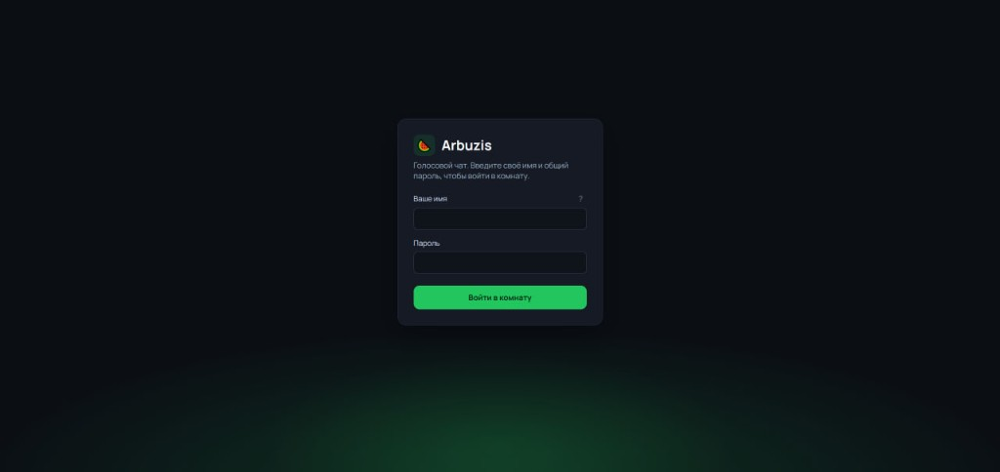
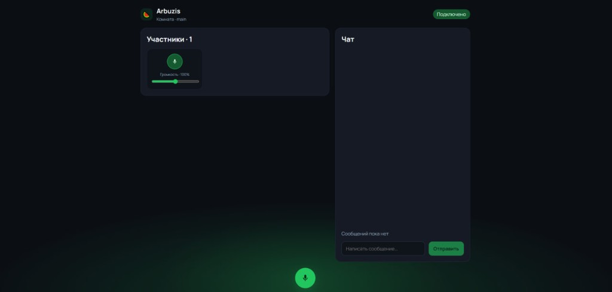

# voice-chat-arbuzis

Простой веб-сервис для голосового общения в одной комнате. Пользователь заходит на сайт, вводит общий пароль и имя, сразу попадает в комнату и может включать/выключать микрофон. Отображается список участников, которые уже в комнате.

## Скриншоты

### Вход



### Комната



## Возможности

- Вход по общему паролю
- Одна комната для всех участников
- Голосовая связь через WebRTC (LiveKit)
- Список участников в комнате
- Включение и выключение микрофона
- Русский интерфейс

## Стек

| Часть | Технология |
|-------|------------|
| Frontend | Angular 21 |
| Backend API | Express + LiveKit Server SDK |
| Медиа-сервер | LiveKit (Docker) |

## Требования

- [Node.js](https://nodejs.org/) 20+
- [Docker](https://www.docker.com/) (для LiveKit)
- npm

## Быстрый старт

### 1. Клонировать репозиторий

```bash
git clone https://github.com/MarkAloha/voice-chat-arbuzis.git
cd voice-chat-arbuzis
```

### 2. Установить зависимости

```bash
npm install
```

### 3. Настроить переменные окружения

Скопируйте пример и отредактируйте пароль:

```bash
cp .env.example .env
```

Основные переменные в `.env`:

| Переменная | Описание |
|------------|----------|
| `SITE_PASSWORD` | Общий пароль для входа на сайт |
| `LIVEKIT_API_KEY` | API-ключ LiveKit (должен совпадать с docker-compose) |
| `LIVEKIT_API_SECRET` | Секрет LiveKit (должен совпадать с docker-compose) |
| `LIVEKIT_URL` | Адрес LiveKit WebSocket (`ws://localhost:7880` для локальной разработки) |
| `ROOM_NAME` | Имя единственной комнаты (по умолчанию `main`) |

### 4. Запустить LiveKit

В **первом терминале**:

```bash
npm run livekit
```

Дождитесь строки `starting LiveKit server`. Проверить, что контейнер работает:

```bash
docker compose ps
```

Статус должен быть **Up**.

### 5. Запустить приложение

Во **втором терминале**:

```bash
npm run dev
```

Команда поднимает:
- API-сервер на `http://localhost:3000`
- Angular-приложение на `http://localhost:4200`

### 6. Открыть в браузере

Перейдите на [http://localhost:4200](http://localhost:4200), введите пароль из `.env` и своё имя.

Для проверки откройте второй браузер или вкладку в режиме инкognito с другим именем.

## Команды

| Команда | Описание |
|---------|----------|
| `npm run livekit` | Запустить LiveKit в Docker |
| `npm run dev` | Запустить API + фронтенд (основная команда для разработки) |
| `npm run api` | Только API-сервер (порт 3000) |
| `npm start` | Только Angular (порт 4200, нужен отдельно запущенный API) |
| `npm run build` | Сборка production |
| `npm test` | Запуск тестов |

## Структура проекта

```text
voice-chat-arbuzis/
├── docs/
│   └── screenshots/        # Скриншоты для README
├── src/
│   ├── app/
│   │   ├── pages/login/    # Экран входа (пароль + имя)
│   │   ├── pages/room/     # Голосовая комната
│   │   ├── services/       # LiveKit, API, сессия
│   │   └── guards/         # Защита маршрута комнаты
│   └── api/                # Backend: проверка пароля, выдача токена
├── dev-api.ts              # Dev-сервер API
├── docker-compose.yml      # LiveKit
├── load-env.ts             # Загрузка .env
└── .env.example            # Пример настроек
```

## Как это работает

1. Пользователь вводит пароль и имя на `/login`.
2. API проверяет пароль и выдаёт JWT-токен для LiveKit.
3. Браузер подключается к LiveKit и публикует аудио с микрофона.
4. Список участников обновляется через события LiveKit Room.

Сессия хранится только в памяти браузера — после обновления страницы (F5) или закрытия вкладки нужно войти заново.

## Деплой на VPS (production)

### Требования

- Ubuntu VPS с Docker и Docker Compose
- Домен с A-записью на IP сервера (например DuckDNS)
- Открытые порты: 80, 443, 7881/tcp, 50000–50100/udp

### 1. DNS

Настройте A-запись:

```text
ваш-домен.example.com  →  IP_вашего_VPS
```

### 2. Firewall на VPS

```bash
sudo ufw allow 22/tcp
sudo ufw allow 80/tcp
sudo ufw allow 443/tcp
sudo ufw allow 7881/tcp
sudo ufw allow 50000:50100/udp
sudo ufw enable
```

### 3. Клонировать и настроить

```bash
git clone https://github.com/MarkAloha/voice-chat-arbuzis.git
cd voice-chat-arbuzis
cp .env.production.example .env
nano .env
```

Обязательно измените в `.env`:

- `SITE_PASSWORD` — пароль для входа
- `LIVEKIT_API_SECRET` — длинный случайный секрет
- `LIVEKIT_NODE_IP` — публичный IP VPS

### 4. Запуск

```bash
docker compose -f docker-compose.prod.yml up -d --build
```

### 5. Проверка

```bash
docker compose -f docker-compose.prod.yml ps
docker compose -f docker-compose.prod.yml logs -f
```

Откройте https://voice-chat-arbuzis.duckdns.org

### 6. Обновление

```bash
git pull
docker compose -f docker-compose.prod.yml up -d --build
```

## Сборка production (локально)

```bash
npm run build
npm run serve:ssr:voice-chat-arbuzis
```

## Частые проблемы

### «Не удалось установить сигнальное соединение»

LiveKit не запущен или контейнер упал. Проверьте:

```bash
docker compose ps
docker compose logs --tail 20
```

Перезапустите:

```bash
npm run livekit
```

### Пароль из `.env` не меняется

Перезапустите `npm run dev` (или `npm run api`). Пароль проверяет API-сервер на порту 3000, а не Angular.

### Микрофон не работает

В браузере нужен HTTPS (или `localhost` для локальной разработки). На VPS без домена и HTTPS микрофон блокируется.

## Лицензия

Private
